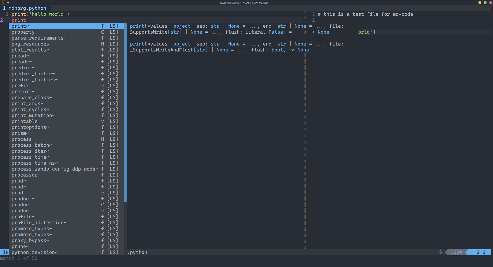

# md-code.nvim

[中文版本](./README_zh.md)  
A plugin that attempts to enhance the experience of embedding code blocks in
markdown files.

Any bug reports/feature requests are welcome.

## Credit

This plugin was inspired from
[this configuration](https://github.com/denstiny/nvim-nanny).

## Usage

A code block that works with this plugin will look like this:

<pre>
```python
print('hello world')
```
</pre>

_`python` may be replaced with any other `filetype` you want. This triggers
other filetype-associated plugins that you may want to use, like lsp and
tree-sitter._

When the cursor is inside a codeblock, running command `:EditBufferCodeBlock`
will open a vertical split that contains the code inside the markdown codeblock:



After you've finished editting, run command `:CloseMdCode` or press `q` in the
code block buffer to save the code to the markdown document.

You may also use this syntax `{.python .number}` to add line-number to the
markdown file. This syntax is supported by [pandoc](https://pandoc.org/), a
powerful document processing tool.
